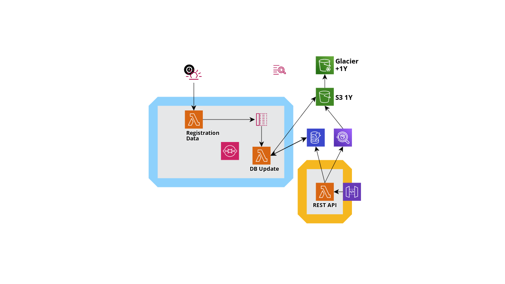

# Identity Provider

Welcome to my instructional application, witch helped me to learn GoLang and Terraform :smile: 

In this repository you will find a simple but helpful example of three types of trigger a Lambda (eventbridge, sqs and http request). All together glued by terraform to proccess and persist data, to be retrieven later using an API interface. 

## Blueprint

## Components

### Registration Data Lambda

Lambda responsible to query for outside data, in this example from a mock origin ([mockaroo.com]()), split in individual records, and post all of them on SQS queue.

### DB Update Lambda

Lambda responsible to read the received data and persist on a DynamoDB table

### REST API Lambda

Lambda responsible to expose the persisted data from DybamoDB

### API Gateway

Component responsible to expose the Lambda to outside of the VPC

### DynamoDB

Component responsible to retain the data, using a TTL (time to live) column to automaticaly remove the obsolete data.

### Bucket S3, Glaciar and Athena

:construction:
Will be available upon issue is implemented
- [ ] #1

## Workspace configuration

To execute 

### Execution

First you need to compile the project using the Makefile script:

> make package

Second, start the **localstack** infrastructure to emulate AWS environment:

> cd localstack
> 