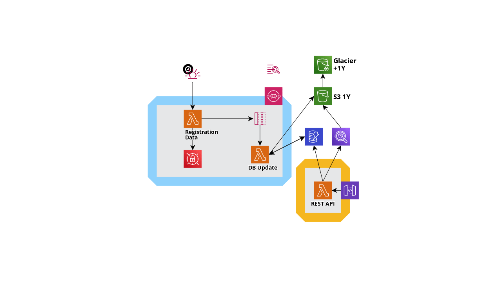

# Identity Provider

Welcome to my instructional application, witch helped me to learn GoLang and Terraform :smile: 

In this repository you will find a simple but helpful example of three types of trigger a Lambda (eventbridge, sqs and http request). All together glued by terraform to proccess and persist data, to be retrieven later using an API interface. 

Special thanks to @erialex to all the support for the last 3 months ! :heart: 

## Blueprint

## Components

### Registration Data Lambda

Lambda responsible to query for outside data, in this example from a mock origin ([mockaroo.com]()), split in individual records, and post all of them on SQS queue.

### DB Update Lambda

Lambda responsible to read the received data and persist on a DynamoDB table

### REST API Lambda

Lambda responsible to expose the persisted data from DybamoDB

### API Gateway

Component responsible to expose the Lambda to outside of the VPC

### DynamoDB

Component responsible to retain the data, using a TTL (time to live) column to automaticaly remove the obsolete data.

### Bucket S3, Glaciar and Athena :construction:

Will be available upon issue #1 is implemented

- [ ] https://github.com/ricardo-comar/identity-provider/issues/1

## Workspace configuration

To execute this application, I recomend you to install the following resources:

- VS Code
- Plugins - Go, Terraform
- Go (golang)
- Python
- AWS CLI
- Terraform
- Localstack
- tflocal
- docker
- docker-compose

### Execution

First you need to compile the project using the Makefile script:

> make package

Second, start the **localstack** infrastructure to emulate AWS environment:

> cd localstack

> docker-compose up

In another terminal configure your AWS CLI, informing same access and secret keys from [docker-compose.yml](localstack/docker-compose.yaml):

> aws configure

Finally, run Terraform commands:

> tflocal init

> tflocal apply -auto-approve

After creating all resources, a scheduled trigger will start the first Lambda after 2 minutes, quering the data and splitting into messages to be persisted on DynamoDB.

To query for the API id, run this following command:

> make gateway

## References
* https://dev.to/makalaaneesh/golang-for-object-oriented-people-l7h
* https://golangbyexample.com/
* https://dynobase.dev/dynamodb-golang-query-examples/
* https://blog.chrismitchellonline.com/posts/aws-sqs-message-with-attributes/
* https://aws.github.io/aws-sdk-go-v2/docs/making-requests/
* https://docs.localstack.cloud/get-started/#localstack-cli
* https://github.com/awsdocs/aws-doc-sdk-examples/tree/main/gov2
* https://reshefsharvit.medium.com/go-faster-with-golang-and-localstack-ace2138dc0e7
* https://christiangiacomi.com/posts/terraform-sns-sqs-lambda/
* https://medium.com/swlh/serverless-super-simple-api-development-with-go-terraform-and-aws-lambda-cc2dd6c531cb
* https://forum.serverless.com/t/eventbridge-trigger-on-localstack-defaults-to-default-event-bus-even-though-a-new-one-is-passed/14709
* https://medium.com/nagoya-foundation/running-and-debugging-go-lambda-functions-locally-156893e4ed0d
* https://reshefsharvit.medium.com/go-faster-with-golang-and-localstack-ace2138dc0e7
* https://levelup.gitconnected.com/setup-your-go-lambda-and-deploy-with-terraform-9105bda2bd18
* https://levelup.gitconnected.com/run-go-aws-lambda-locally-with-localstack-and-serverless-framework-5c80894f389c
* https://medium.com/@jain.vaibhav09/run-aws-resources-on-macos-locally-2aa2e1940eb4
* http://www.inanzzz.com/index.php/post/1e0r/using-aws-eventbridge-to-manually-send-events-to-lambda-functions-in-golang
* https://github.com/terraform-aws-modules/terraform-aws-eventbridge/tree/v1.15.1/examples
* https://openupthecloud.com/terraform-lambda-scheduled-event/